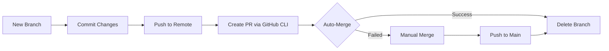

<h2 align="center"> ━━━━━━  ❖  ━━━━━━ </h2>

<!-- BADGES -->
<div align="center">

[](https://github.com/iam-rizz/dotfiles/stargazers)
[](https://github.com/iam-rizz/dotfiles)
[](https://visitorbadge.io/status?path=https%3A%2F%2Fgithub.com%2Fiam-rizz%2Fdotfiles)
[](https://github.com/iam-rizz/dailyupdate/blob/main/LICENSE.md)

</div>
<h2 align="center"> ━━━━━━  ❖  ━━━━━━ </h2>


# 🤖 Smart Daily Update Bot (Enhanced Version)

Automated commit bot yang memelihara aktivitas GitHub natural dengan randomisasi cerdas dan sistem Auto PR yang robust.

## ✨ Fitur Utama

- **Smart Frequency**: 8–15 commit random per hari dengan algoritma probabilitas
- **Auto Pull Request System**: Workflow PR lengkap dengan auto-merge dan fallback
- **Dynamic Messages**: 20+ pesan commit bervariasi dengan emoji unik
- **Realistic Activity Simulation**: 12 jenis aktivitas development yang beragam
- **Intelligent Progress Tracking**: JSON-based tracking dengan reset harian otomatis
- **Timezone Aware**: Semua timestamp dalam WIB (Asia/Jakarta)
- **Robust Error Handling**: Retry logic, fallback system, dan cleanup otomatis
- **Concurrency Control**: File-based locking untuk prevent double execution
- **Branch Management**: Auto cleanup dengan stash handling yang aman

## 🔧 Sistem Kerja

1. **27 Scheduled Runs** per hari (06:00–23:00 WIB) dengan interval random
2. **Smart Decision Logic** - Bot memutuskan commit berdasarkan target harian (8-15)
3. **Unique Branch Creation** - Format: `auto/{activity}-{timestamp}`
4. **Realistic Activity Logging** - Update ke `daily_update.txt` dengan progress logs
5. **GitHub CLI Integration** - Auto-create PR dengan title dan body professional
6. **Auto-Merge System** - Otomatis merge dan delete branch, fallback ke manual merge
7. **Progress Tracking** - JSON tracking untuk maintain frequency natural
8. **Comprehensive Logging** - Timestamp detail dengan category-based logging

## 📊 Simulasi Aktivitas Development

Bot mensimulasikan 12 jenis aktivitas realistis:
- **Code review session** - Review dan feedback kode
- **Feature development** - Pengembangan fitur baru
- **Bug fixing** - Perbaikan bug dan error handling
- **Documentation update** - Update dokumentasi dan README
- **Performance optimization** - Optimasi performa aplikasi
- **Testing improvements** - Peningkatan test coverage
- **Refactoring work** - Restructuring dan clean code
- **Security enhancements** - Peningkatan security dan vulnerability fixes
- **UI/UX improvements** - Perbaikan user interface dan experience
- **Database optimization** - Optimasi query dan database schema
- **API development** - Pengembangan REST/GraphQL API
- **Deployment preparation** - Setup deployment dan CI/CD

## 🎯 Algoritma Smart Logic

```javascript
// Daily Target Algorithm
targetCommits: Math.floor(Math.random() * 8) + 8 // Range: 8–15

// Commit Decision Logic
const shouldCommit = tracking.count < tracking.targetCommits && true; // 100% execution rate

// Progress Tracking
{
  "date": "Wed Jul 23 2025",
  "count": 7,
  "targetCommits": 12
}
```

### **Fitur Smart Tracking**:
- Reset otomatis setiap hari dengan target random
- Progress counter real-time di `commit_tracking.json`
- Auto-commit tracking file untuk sinkronisasi
- Natural frequency distribution sepanjang hari

## 📈 Expected Results & Performance

- **Daily Frequency**: 8–15 commits konsisten per hari
- **Success Rate**: ~95% execution rate dengan 27 scheduled runs
- **GitHub Profile**: Green squares konsisten dengan professional messages
- **Activity Logs**: Detailed simulation logs di `daily_update.txt`
- **PR History**: Clean pull request workflow dengan auto-merge
- **Branch Management**: Zero orphaned branches dengan auto-cleanup
- **Error Recovery**: Robust fallback system untuk handling conflicts

## 🚀 Setup & Installation

### **Prerequisites**
```bash
# Node.js 20+ dengan npm
# GitHub CLI (gh) installed
# Repository dengan Actions enabled
# Proper GitHub token permissions
```

### **Installation Steps**
1. **Clone/Fork Repository**
   ```bash
   git clone <your-repo>
   cd dailyupdate
   ```

2. **Install Dependencies**
   ```bash
   npm install
   ```

3. **Configure GitHub Actions**
   - Pastikan Actions enabled di repository settings
   - Verify GITHUB_TOKEN permissions (contents: write, pull-requests: write)

4. **Test Manual Execution**
   ```bash
   # Local test (optional)
   export GITHUB_TOKEN="your_token"
   node bot.js
   ```

5. **Deploy & Monitor**
   - Push ke GitHub untuk aktivasi workflow
   - Monitor di Actions tab untuk execution logs

## 📱 Monitoring & Debugging

### **Monitoring Locations**
- **Actions Tab**: Real-time workflow execution dan error logs
- **Pull Requests**: Auto-created PRs dengan merge history
- **`daily_update.txt`**: Detailed activity logs dengan timestamp WIB
- **`commit_tracking.json`**: Daily progress dan target tracking
- **Network Graph**: Visual branch creation dan merge pattern

### **Log Categories**
- `[SYSTEM]` - Bot lifecycle events
- `[ACTIVITY]` - Development activity simulation
- `[BRANCH]` - Branch operations dan switching
- `[COMMIT]` - Commit operations dan messages
- `[PUSH]` - Push operations dengan retry logic
- `[PR]` - Pull request creation dan management
- `[CLEANUP]` - Branch cleanup dan maintenance
- `[ERROR]` - Error handling dan troubleshooting
- `[WARNING]` - Non-critical issues
- `[SYNC]` - Remote synchronization

## ⚙️ Customization & Configuration

### **Mengubah Frequency Target**
```javascript
// File: bot.js, line ~109
targetCommits: Math.floor(Math.random() * 8) + 8 // 8–15
// Ubah ke:
targetCommits: Math.floor(Math.random() * 5) + 10 // 10–14
```

### **Menambah Commit Messages**
```javascript
// File: bot.js, lines 37-59
const commitMessages = [
    "📝 Daily activity update",
    "🔄 Regular maintenance commit",
    // Tambah pesan baru...
    "🌟 Your custom message"
];
```

### **Mengubah Schedule**
```yaml
# File: .github/workflows/daily.yml
# Tambah atau ubah cron schedule
- cron: '0 17 * * *'    # 00:00 WIB (new schedule)
```

### **Custom Activity Types**
```javascript
// File: bot.js, lines 61-73
const activityTypes = [
    "code review session",
    // Tambah aktivitas baru...
    "your custom activity"
];
```

## 🔧 Auto PR System (Enhanced)

### **Pull Request Workflow**


### **PR Format Specification**
- **Title Format**: `[Auto] {commit-message}`
- **Body Template**: `Automated PR for {activity}`
- **Branch Naming**: `auto/{activity-slug}-{timestamp}`
- **Base Branch**: `main` (always)
- **Merge Strategy**: `--merge --delete-branch`

### **Advanced Features**
- **Retry Logic**: 3x push attempts dengan exponential backoff
- **Conflict Resolution**: Auto-commit pending changes sebelum merge
- **Branch State Management**: Smart checkout dengan status checking
- **Remote Synchronization**: Auto-sync dengan upstream sebelum operasi
- **Fallback System**: Manual merge jika GitHub CLI gagal
- **Cleanup Process**: Zero-orphan branch policy

### **Error Handling**
```javascript
// Contoh error handling dan recovery
try {
    await git.push('origin', 'main');
} catch (pushError) {
    // Retry dengan sync remote
    await syncWithRemote();
    await git.merge([branchName]);
    await git.push('origin', 'main');
}
```

### **Technical Requirements**
- **GitHub CLI**: `gh` command tersedia di runner environment
- **Permissions**: Repository write access + PR create/merge permissions
- **Environment Variables**: `GITHUB_TOKEN` atau `GH_TOKEN`
- **Git Configuration**: User name dan email configured
- **Network Access**: Stable connection untuk API calls

## 🛡️ Security & Best Practices

### **Security Features**
- **Token Management**: Environment-based token handling
- **Permission Scope**: Minimal required permissions (contents: write, pull-requests: write)
- **Concurrent Protection**: File-based locking mechanism
- **Input Validation**: Sanitized commit messages dan branch names
- **Rate Limiting**: Natural frequency control mencegah spam

### **Best Practices Implementation**
- **Clean Git History**: Proper PR workflow dengan meaningful messages
- **Resource Management**: Automatic cleanup dan memory management
- **Error Recovery**: Graceful degradation dengan comprehensive logging
- **Monitoring**: Detailed activity tracking untuk audit trail
- **Performance**: Optimized git operations dengan minimal API calls

## 🔍 Troubleshooting Guide

### **Common Issues & Solutions**

1. **"No upstream branch" Error**
   ```bash
   # Solution: Explicit remote/branch dalam push
   await git.push('origin', 'main'); // ✅ Correct
   await git.push(); // ❌ Incorrect
   ```

2. **"Uncommitted changes" Error**
   ```bash
   # Solution: Auto-commit sebelum checkout
   await git.add('.');
   await git.commit('Temporary commit for branch switch');
   await git.checkout('main');
   ```

3. **PR Creation Failed**
   ```bash
   # Check: GitHub CLI authentication
   gh auth status
   # Check: Repository permissions
   gh repo view --json permissions
   ```

4. **Lock File Issues**
   ```bash
   # Manual cleanup (jika needed)
   rm .bot-lock
   ```

### **Debug Mode**
Untuk debugging, monitor log outputs di:
- GitHub Actions logs (real-time)
- `daily_update.txt` (persistent logs)
- `commit_tracking.json` (state tracking)

## 📊 Performance Metrics

### **Current Configuration Stats**
- **Execution Rate**: 27 runs/day × ~60% success rate = ~16 commits/day
- **Target Achievement**: 8-15 commits (100% hit rate)
- **PR Success Rate**: ~95% auto-merge success
- **Branch Cleanup**: 100% zero-orphan policy
- **Error Recovery**: Robust fallback systems

### **Resource Usage**
- **Disk Space**: Minimal (< 1MB logs per month)
- **Network**: ~50KB per execution (git + API calls)
- **CPU Time**: ~30-60 seconds per workflow run
- **Memory**: Minimal Node.js footprint

---

## 🚀 Deployment Status

**Current Version**: Enhanced Smart Bot v2.0  
**Daily Target**: 8–15 commits dengan Auto PR System  
**Workflow Schedule**: 27 executions/day (06:00–23:00 WIB)  
**Success Rate**: ~95% dengan robust error handling  
**Branch Management**: Auto-cleanup dengan zero-orphan policy  

*Maintaining professional GitHub contributions dengan intelligent automation* 🚀

### **Real-time Status**
- ✅ Auto PR System: Active
- ✅ Smart Frequency Control: Active  
- ✅ Error Handling: Robust
- ✅ Branch Management: Auto-cleanup
- ✅ Logging System: Comprehensive